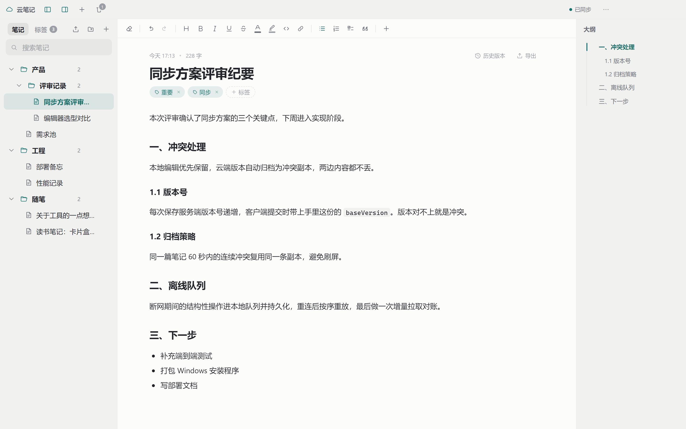
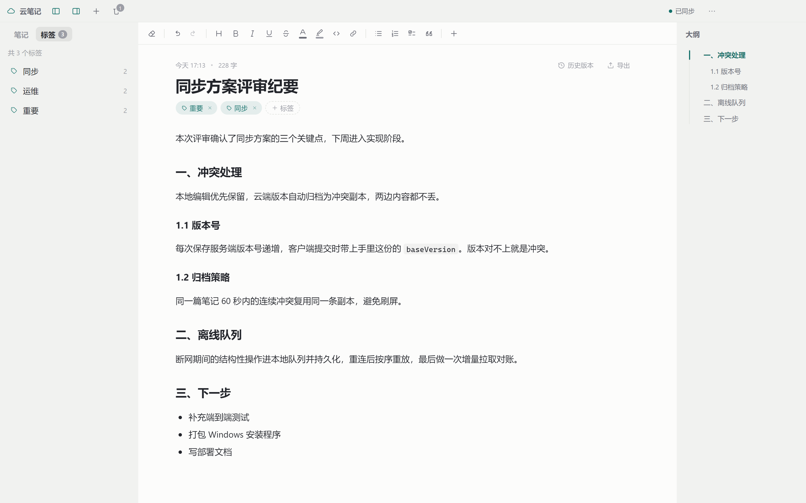
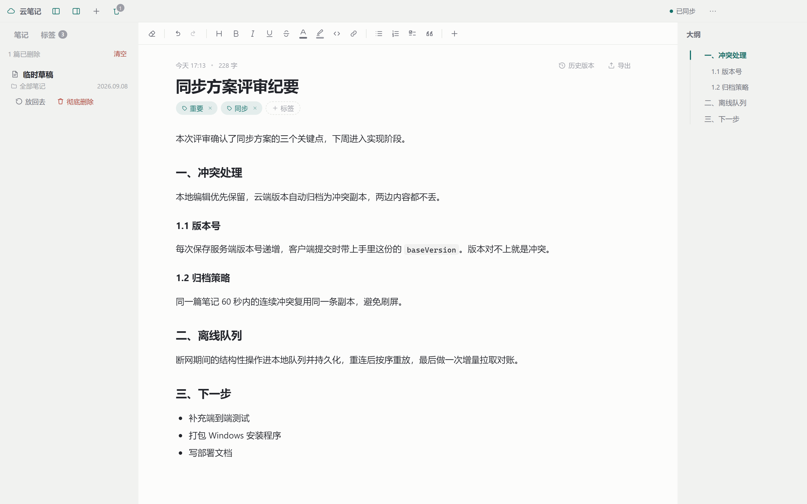
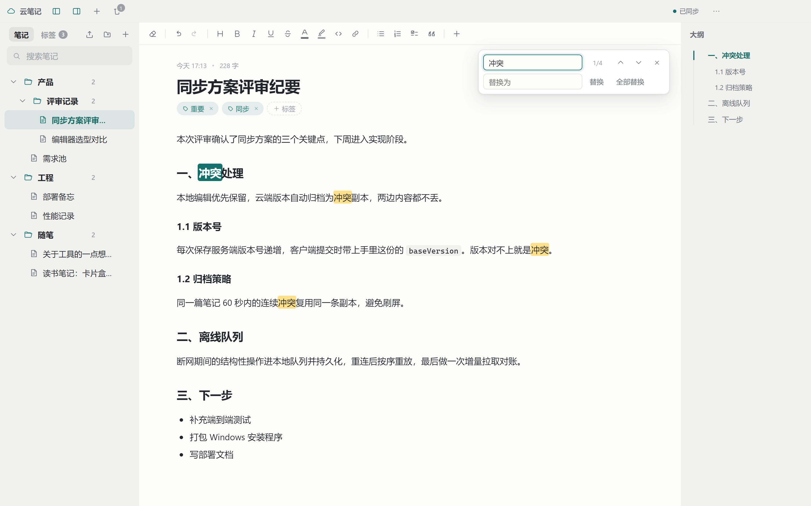
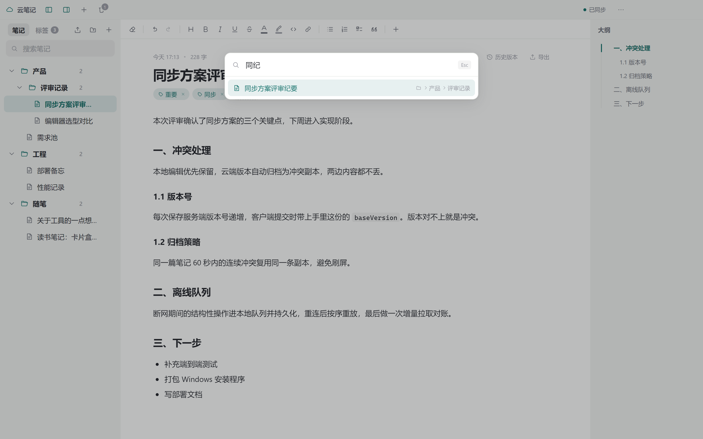
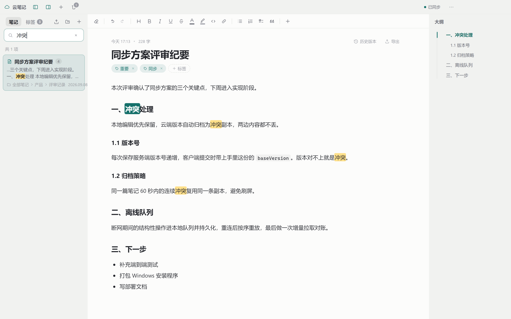
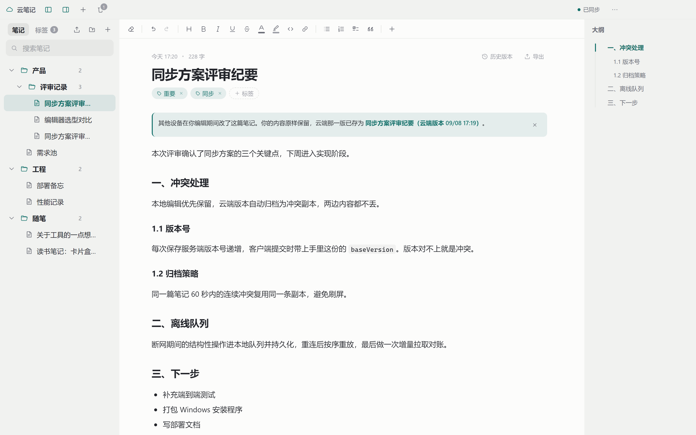
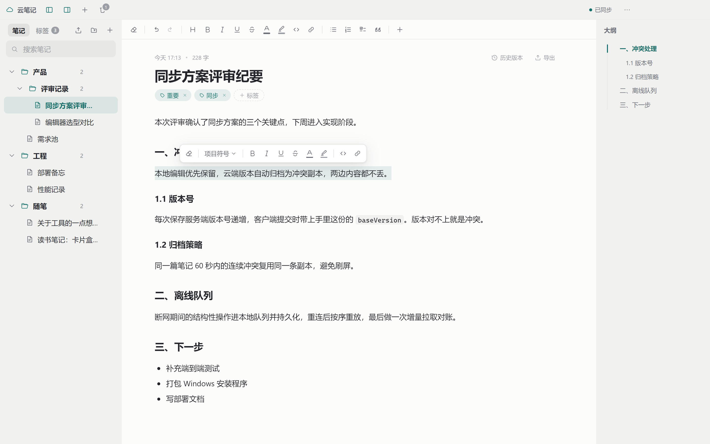
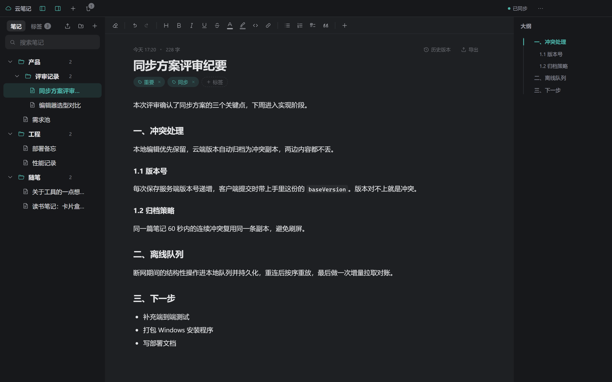

# CloudNote

[](LICENSE)
[](https://nodejs.org/)
[](#)

**English** | [简体中文](README.md)

A self-hosted desktop note app: folder tree on the left, editor in the middle,
auto-generated outline on the right, synced across devices in real time.

Your data stays on your own server — one Node process and one SQLite file.
No native modules, no external database, no third-party service.



## What it does

- **Three-pane layout**, both side panes collapsible and resizable
- **Real-time sync** over WebSocket. If another device is *reading*, it hot-updates.
  If it is *editing*, the incoming cloud version is archived as a conflict copy — neither side is lost.
- **Works offline**: keep editing while disconnected; the queue replays and reconciles on reconnect
- **Markdown-style editing** (Tiptap/ProseMirror): live formatting, a bubble toolbar on selection,
  images uploaded on paste or drop
- **Organization**: drag notes into folders and reorder siblings, cross-cutting tags,
  full-text search, `Ctrl+P` quick jump
- **Safety nets**: soft-delete trash, automatic version snapshots with restore, Markdown export
- **Lives in the tray**: closing the window only hides it; the app keeps running and keeps syncing
- **Self-updating**: the client finds new versions on its own, downloads in-app, verifies the sha256, launches the installer
- **Web admin**: manage accounts and publish client builds; the web app also offers the installer for download
- **Web version**: same frontend code, usable straight from a browser, live-synced with the desktop app

## Tech stack

| | |
|---|---|
| Desktop | Electron + electron-vite + React 18 + TypeScript |
| Editor | Tiptap 3 (ProseMirror) |
| Server | Fastify 5 + `node:sqlite` (built into Node 24) + `@fastify/websocket` |
| Sync | A monotonic per-note `version` for optimistic locking, a per-account `seq` cursor for incremental pull |

## Quick start

```bash
npm run install:all   # install server and client dependencies
npm run dev           # start the sync service and the desktop client together
```

Click "创建一个" (Create one) on the login page to register. The service listens on
`http://localhost:4471` by default; to point at your own server, click "换一个同步服务"
(Use a different sync service) on the login page and enter the address.

Run pieces separately:

```bash
npm run server        # sync service only
npm run app           # desktop client only
npm test              # server end-to-end tests (71 of them)
npm run dist          # build the Windows installer into app/release
```

> Requires **Node 24 or newer** — the server uses Node's built-in SQLite (`node:sqlite`).

## Layout

```
note/
├── server/           Sync service: Fastify + node:sqlite + WebSocket
│   ├── src/db.js       Schema, transactions, per-user monotonic change sequence
│   ├── src/uploads.js  Image storage and retrieval
│   ├── src/auth.js     Registration, login, JWT, auth hook
│   ├── src/routes.js   Folder and note endpoints, optimistic version locking
│   ├── src/hub.js      WebSocket broadcast grouped by account
│   └── test/e2e.js     End-to-end tests
└── app/              Electron client
    ├── src/main/       Main process: window, theme, bundled server for packaged builds
    ├── src/preload/    Safe bridge between renderer and main
    └── src/renderer/
        ├── lib/sync.ts     Sync engine: debounced saves, conflict archiving, offline queue
        ├── lib/store.ts    Global state and local cache
        ├── lib/outline.ts  Heading extraction and scroll positioning
        ├── lib/images.ts   Image upload (paste / drop / file picker)
        └── components/     The three-pane UI
```

## Folder tree

Create folders and subfolders, rename, delete — from the right-click menu or the buttons at the end of each row.

Where you drop decides what happens, based on the pointer's height within the row:

- **Near the top or bottom edge** → reorder before/after that item at the same level; an insertion line with a dot appears
- **In the middle of a folder** → move into that folder; the whole row gets an outline
- **On empty space below the list** → move out to the root level
- Hover over a collapsed folder for a moment and it expands, so you can drop deeper

A folder cannot be dragged into its own descendant. Ordering syncs to all devices.

## Tags, trash and history

**Tags** live above the note title. Typing suggests tags you have already used, so the same
idea does not end up spelled several ways. The "标签" (Tags) tab in the sidebar lists every tag
with its note count; click one to filter. Clicking a tag inside a note filters the same way.
Folders are single-membership; tags are for cross-cutting classification.



**Trash**: deletion is soft. Notes go to the trash first. The trash button in the title bar
(with a pending count) opens it; from there you can restore or delete permanently (irreversible).
Click the button again to go back to the note list.



**History**: body edits are snapshotted automatically — at most one version every few minutes,
keeping the latest 40 per note, so continuous typing does not flood the history.
"历史版本" (History) at the top right of a note previews and restores any version;
restoring also snapshots the current content, so you can always go back.

**Export**: a single note (right-click → export as Markdown), a folder (right-click the folder),
or everything (the export button at the top of the sidebar). Bulk export mirrors the original
folder hierarchy on disk, numbering notes that share a name.

## Find and replace

Press `Ctrl+F` (or `Ctrl+H`) inside the editor. Find and replace share one bar — there are no
separate modes. If text is selected when you open it, that text becomes the search term;
pressing the shortcut again while it is open updates the term from the current selection.



| Action | Shortcut |
|---|---|
| Next match | `Enter` |
| Previous match | `Shift+Enter` |
| Close | `Esc` |

Every match is highlighted; the current one gets an accent color and scrolls into the middle of
the view, with a `3/12` counter on the right. "Replace" changes only the current match;
"Replace all" reports how many it changed. Highlights clear when you close the bar.

This searches the current note only. Use the sidebar search box to search across notes.

## Quick jump and search

`Ctrl+P` opens quick jump: type part of a title. Matching is by **subsequence** — the characters
you type only need to appear in order, not consecutively — so `同纪` finds 「同步方案评审纪要」
and `qs` finds `Quick Start`. Arrow keys to select, Enter to open.





The search box at the top left does full-text search over titles and bodies. Results are ranked
by relevance: title matches first, then how many times the body matches, then modification time.

Each result shows the surrounding context with the term highlighted, the note's folder path,
and the modification date; the number at the top right is how many matches that note contains.
Click a result to open the note — every match is highlighted and the page jumps straight to the
first one, which is marked in a solid accent color to distinguish it from the rest.
Clear the search box and the highlights go away.

## How sync works

**Saving**: an edit is committed 700ms after you stop typing; `Ctrl+S` commits immediately.
It is *not* one request per keystroke — while you keep typing the timer keeps sliding, and only
a pause sends it. But it does not slide forever: a note is forced to save after at most 5 seconds,
so a ten-minute writing burst is never sitting entirely on your machine. Only one request per note
is ever in flight; changes made meanwhile are merged into the next one, so two requests can never
race with the same version number and collide.

Every note carries a monotonic `version`, sent along with each save.

**Pushing**: after the server commits, it pushes the new content over WebSocket to the account's
other devices. The originating device does not receive an echo.

**Conflicts**: when two devices edit the same note, the rule is
**the local edit always wins; the cloud version is archived in full**.

- If a remote change arrives and you are *not* editing that note → the body hot-updates in place.
- If you *are* editing → your content is untouched, and the other version is saved as a
  「XXX（云端版本 <time>）」 note in the same folder, with a notice above the editor that
  jumps you there for comparison.
- Repeated conflicts within 60 seconds reuse the same copy instead of piling up.



Neither version is ever lost; merging is your call.

**Offline**: while disconnected, creates/deletes/moves go into a persisted local queue and body
edits stay in memory. On reconnect the queue replays first, then pending bodies are flushed,
then an incremental pull reconciles. The pull uses a per-account `seq` cursor and fetches only
what changed.

## Titles

The title at the top of the editor is a property of the note, not part of the body
(so it does not appear in the outline).

The rule is: **the title is derived only while it is empty, and once taken it stays.**
It is derived at exactly two moments:

- when you press `Ctrl+S`
- when you leave the note, or close the window

Typing never touches the title. The first line of the body is a half-finished thing while you
type — "h", "he" — and taking it then would name the note after a fragment. Once you save or
walk away, the content has settled, so the title is taken and then fixed: no amount of later
editing overwrites it. Clear the title if you want it derived again on the next save.

The same applies to IME composition: half-typed pinyin is never committed as a title.

Right-click → rename in the sidebar edits the very same field.

## Editor

Built on Tiptap (ProseMirror), with Markdown-style input applied as you type:

| Input | Result | | Input | Result |
|---|---|---|---|---|
| `# ` | Heading 1 | | `> ` | Blockquote |
| `## ` | Heading 2 | | ` ``` ` | Code block (highlighted) |
| `- ` | Bullet list | | `1. ` | Ordered list |
| `[] ` | Task item | | `---` | Divider |

**Selecting text** floats a formatting bar right there, so your hand never travels back to the top:



The top toolbar has the same capabilities plus lists, quotes and an insert menu.
"Clear formatting" comes first.

**Colors** come as a small preset set — the text colors are mid-tone, so a note stays legible in
both light and dark themes. When the presets are not enough, "自定义颜色…" (Custom color) opens a
full picker: a saturation/value field, a hue bar, an alpha bar, and HEX / RGBA number inputs.
All four edit the same color and stay in sync. Text color and highlight share the picker.

`Ctrl` + click on a link opens it in the system browser; without the modifier it just places the
caret. Only http/https/mailto/ftp are allowed through, so a `javascript:` URL pasted into a note
will not open.

When inserting a link, if the selected text is already a URL or an email address, the field is
pre-filled — `www.example.com` becomes `https://www.example.com`, `someone@example.com` becomes
a `mailto:` link — so you can just press Enter.

**Images** can be pasted, dropped, or picked from the insert menu. They are always uploaded to the
server first and inserted as a link, never embedded as base64 — inlining would bloat the note and
re-upload the whole image on every save. 10MB per image; png / jpg / gif / webp / svg / bmp / avif.

The body width follows the window, with margins growing proportionally. The outline on the right
tracks headings live, jumps on click, and highlights your position as you scroll.

Appearance is chosen in Settings (top right): follow the system, light, or dark. The choice is
remembered, so the next launch looks the same.



## Client updates

The server keeps a list of published builds. The client checks silently 8 seconds after start
and every 6 hours after that; "检查更新" (Check for updates) under Settings > 关于 (About) triggers it
manually and shows the current version next to it.

When a newer version exists, a dialog shows the release notes **exactly as you typed them**
in the admin panel. "立即更新" downloads in-app with a progress bar, verifies the sha256, and only
then launches the installer and quits (NSIS needs the running app gone to overwrite it).
A checksum mismatch deletes the file and asks you to retry — an unverified exe is never handed
to the user to double-click.

`electron-updater` is deliberately not used: it wants `latest.yml` and blockmaps laid out its way
on the server, and an unsigned app has to disable signature verification on top of that. Not worth
another dependency here. The cost is no delta downloads and no silent install.

The web version has none of this; instead the login page and the title bar offer
"下载 Windows 客户端" (Download the Windows client).

## Admin panel

**Web only** — it is an operations tool, a browser is the right place for it, and it does not need
to take up a slot in the desktop client's menu.

Admins are listed in `CLOUDNOTE_ADMINS` in `server/.env` (comma-separated emails). Sign in with a
normal note account; if the address is on the list, "后台管理" (Admin) appears in the title bar.

Deliberately not a role column in the database: permissions cannot be changed by accident through
the UI, and if you lock yourself out, one SSH edit and a restart brings it back. The cost is that
adding or removing an admin requires a restart.

| Page | What it does |
|---|---|
| Users | Email, display name, signup time, last active, note count, connected devices; disable/enable, reset password, delete account |
| Client builds | Upload an installer (with progress), write release notes, publish/unpublish, delete |

Guard rails: an admin cannot disable or delete their own account; deleting an account requires
typing the target email, which the server checks again; disabling immediately drops that account's
WebSocket connections and invalidates already-issued tokens on the next request.

Deleting an account is a **hard delete** — notes, folders, revisions and uploaded images all go,
without passing through the trash, with no way back.

## Window and tray

The close button in the title bar **does not quit the app** — it hides the window to the system
tray. The WebSocket stays connected, so changes made on other devices still arrive, and reopening
the window does not have to refetch everything.

- **Click** the tray icon → bring the window back
- **Right-click** the tray icon → "打开云笔记" (Open) / "退出" (Quit). Quitting for real goes through here.

A balloon tip appears the first time the window is tucked away, so it is not mistaken for a crash.

Only one instance runs at a time. Clicking the desktop shortcut again while the window is hidden
brings the existing window forward instead of starting a second copy — otherwise a packaged build
would spawn a second bundled server fighting over the same port.

## Keyboard shortcuts

| Shortcut | Action |
|---|---|
| `Ctrl+N` | New note |
| `Ctrl+P` | Quick jump to a note |
| `Ctrl+S` | Save now |
| `Ctrl+\` | Toggle the folder pane |
| `Ctrl+Shift+/` | Toggle the outline pane |
| `Ctrl+B` / `Ctrl+I` / `Ctrl+U` | Bold / italic / underline |
| `Ctrl+K` | Insert link |
| `Ctrl+F` | Find and replace |
| `Ctrl` + click a link | Open in the system browser |

## Housekeeping

Deletion is soft — that record is how "it's gone" reaches the other devices — and images are not
removed with the note, since the note may be restored. Over time this accumulates; the cleanup
tool collects it:

```bash
cd server
npm run gc                      # report only, changes nothing
npm run gc -- --apply           # actually clean
npm run gc -- --days 90 --apply # only soft-deletes older than 90 days (default 30)
```

It hard-deletes expired soft-deleted records, removes images no note references, and compacts the database.

## Self-hosting

**Using the BaoTa (aaPanel) control panel? See [deploy/README.md](deploy/README.md)** — it covers
everything from installing Node to configuring HTTPS, plus a one-command setup script.

Manual deployment is simple too; the server is an ordinary Node process (needs **Node 24+**
for the built-in SQLite):

```bash
cd server && npm install --omit=dev
CLOUDNOTE_SECRET=<a random secret> PORT=4471 npm start
```

You can also put the configuration in `server/.env` (see `server/.env.example`); it is read at startup.

| Variable | Meaning | Default |
|---|---|---|
| `PORT` | Listen port | `4471` |
| `HOST` | Listen address | `0.0.0.0` |
| `CLOUDNOTE_SECRET` | JWT signing key — **must be changed in production** | a development default |
| `CLOUDNOTE_DB` | SQLite file path | `server/data/cloudnote.db` |
| `CLOUDNOTE_UPLOADS` | Image directory | `server/data/uploads` |
| `CLOUDNOTE_AUTH_LIMIT_ID` | Allowed login failures per account per 5 minutes | `5` |
| `CLOUDNOTE_AUTH_LIMIT_IP` | Allowed login failures per IP per 5 minutes | `30` |
| `CLOUDNOTE_ADMINS` | Admin emails, comma-separated. Empty means nobody can reach the admin panel | empty |
| `CLOUDNOTE_RELEASES` | Where client installers are stored | `server/data/releases` |

Login rate limiting counts **failures** only and resets on success, so ordinary users never hit it.
It works on two axes: per account, which stops credential stuffing against one address, and per IP,
which stops bulk scanning across many addresses — without locking you out because someone else
behind the same NAT mistyped their password. Uploads are separately limited to 60 per account per minute.

Images are stored at `uploads/<user id>/<32 random chars>` and served without authentication —
the filename is long enough that the URL itself is the credential, which is what lets ``
work without a login header. Keep that in mind on a public server: anyone with the link can view
the image.

For public deployments, put the service behind an HTTPS reverse proxy and make sure the proxy
forwards WebSocket upgrades (Nginx needs `proxy_set_header Upgrade $http_upgrade;` and
`Connection "upgrade"`). Set the client's login page to `https://your-domain`; the WebSocket
follows to `wss://` automatically.

To make an installed client point at your server by default, inject the address at build time:

```bash
cd app && VITE_CLOUDNOTE_SERVER=https://note.example.com npm run dist
```

Always inject the address for clients you hand to other people. Without it the default is
`http://localhost:4471` and a freshly installed client cannot connect — the packaged build is
meant to fall back to a bundled backend, but that path is currently broken: Electron 33 ships
Node 20.18.3 while the server needs `node:sqlite` (Node 24), so the forked server never starts.
Injecting the address makes `__USE_BUNDLED_SERVER__` false, so nothing is forked.

Users can still change it: the "换一个同步服务" (Use another sync service) button on the login
page is always available.

## Contributing

Issues and pull requests are welcome. Start with [CONTRIBUTING.en.md](CONTRIBUTING.en.md) for setup,
layout and the self-check list; participation is covered by the
[Code of Conduct](CODE_OF_CONDUCT.en.md).

At minimum, run these after a change:

```bash
npm run server        # the e2e suite talks to a running server (use another terminal)
npm test              # server end-to-end, 71 checks (admin ones need CLOUDNOTE_ADMINS=admin@test.local)
cd app && npm run typecheck
```

## License

[Apache License 2.0](LICENSE)

```
Copyright 2026 jiaxing

Licensed under the Apache License, Version 2.0 (the "License");
you may not use this file except in compliance with the License.
You may obtain a copy of the License at

    http://www.apache.org/licenses/LICENSE-2.0

Unless required by applicable law or agreed to in writing, software
distributed under the License is distributed on an "AS IS" BASIS,
WITHOUT WARRANTIES OR CONDITIONS OF ANY KIND, either express or implied.
See the License for the specific language governing permissions and
limitations under the License.
```
